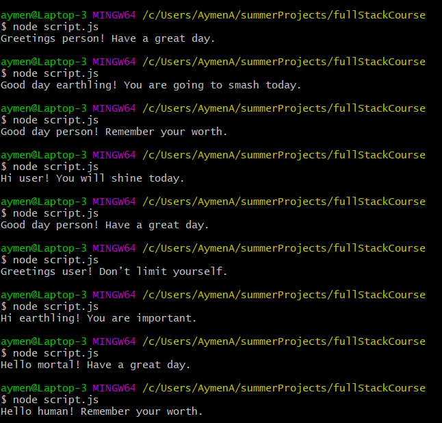

# Random message generator
The project is a random inspirational message generator program written JavaScript!

## General Information
Although the actual JavaScript used is basic, this project allowed me to experience other essential technologies new to me and become more familiar with using Git version control, Node, Markdown, the command line, and using my environment to develop locally on my laptop.

## Technologies Used
- JavaScript 
- Node
- Markdown 
- Git version control
- Linux command line

## Screenshots

<!-- If you have screenshots you'd like to share, include them here. -->

## Project Status
Project is: _complete_

## Room for Improvement
- Add methods to for pushing and popping strings into the arrays, in order not to manipulate arrays directly.
- Add default messages which will be used if any array is empty.

## Acknowledgements
- This project was based on [this full stack engineering career path](https://www.codecademy.com/learn/paths/full-stack-engineer-career-path).

